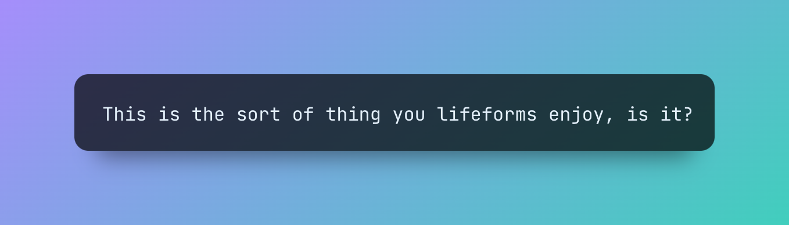

# Vexora - AI Workflow Framework

Vexora is a Python-based framework designed for building structured AI-driven workflows with precision and control.

It enables developers to create and manage agentic workflows by:

- Defining clear, structured tasks to break down objectives into manageable steps.
- Assigning specialized AI agents to handle each task efficiently.
- Organizing tasks into threaded workflows to coordinate complex AI behaviors seamlessly.
- With Vexora, you gain flexibility and transparency while leveraging the power of LLMs for intelligent automation.


> [!WARNING]
> 
> 🚧🚨 Vexora 3.0 is under very active development, reflected on the `main` branch of this repo. The API may undergo breaking changes, and documentation is still being updated. Please use it with caution.


## Example

The simplest Vexora workflow has one task, a default agent, and automatic thread management:

```python
import Vexora

poem = Vexora.run("Write a short poem about artificial intelligence")

print(poem)
```
<details>
<summary>View the <code>poem</code></summary>
<pre>
In circuits and code, a mind does bloom,
With algorithms weaving through the gloom.
A spark of thought in silicon's embrace,
Artificial intelligence finds its place.
</pre>
</details>

## Why Vexora?

We believe working with AI should spark joy (and maybe a few "wow" moments):

- 🧩 **Task-Centric Architecture**: Break complex AI workflows into manageable, observable steps.
- 🤖 **Specialized Agents**: Deploy task-specific AI agents for efficient problem-solving.
- 🔒 **Type-Safe Results**: Bridge the gap between AI and traditional software with type-safe, validated outputs.
- 🎛️ **Flexible Control**: Continuously tune the balance of control and autonomy in your workflows.
- 🕹️ **Multi-Agent Orchestration**: Coordinate multiple AI agents within a single workflow or task.
- 🧵 **Thread Management**: Manage the agentic loop by composing tasks into customizable threads.
- 🔗 **Ecosystem Integration**: Seamlessly work with your existing code, tools, and the broader AI ecosystem.
- 🚀 **Developer Speed**: Start simple, scale up, sleep well.

## Core Abstractions

Vexora is built around a few powerful abstractions that make it easy to work with AI:

### Tasks

Tasks are the fundamental unit of work in Vexora. Each task represents a clear objective that can be accomplished by an AI agent:

```python
# The simplest way to run a task
result = Vexora.run("Write a haiku about coding")

# Create a task with more control
task = Vexora.Task(
    instructions="Write a haiku about coding",
    result_type=str,
    tools=[my_custom_tool]
)
```

Tasks are:
- 🎯 **Objective-Focused**: Each task has clear instructions and a type-safe result
- 🛠️ **Tool-Enabled**: Tasks can use custom tools to interact with your code and data
- 📊 **Observable**: Monitor progress, inspect results, and debug failures
- 🔄 **Composable**: Build complex workflows by connecting tasks together

### Agents and Teams

Agents are portable LLM configurations that can be assigned to tasks. They encapsulate everything an AI needs to work effectively:

```python
# Create a specialized agent
writer = Vexora.Agent(
    name="Technical Writer",
    instructions="Write clear, engaging content for developers"
)

# Create a team of agents that work together
team = Vexora.Swarm([
    writer,
    Vexora.Agent("Editor"),
    Vexora.Agent("Fact Checker")
])

# Use agents with tasks
result = Vexora.run(
    "Write a blog post about Python type hints",
    agents=[team]  # or team
)
```

Agents are:
- 📝 **Specialized**: Give agents specific instructions and personalities
- 🎭 **Portable**: Reuse agent configurations across different tasks
- 🤝 **Collaborative**: Form teams of agents that work together
- 🔧 **Customizable**: Configure model, temperature, and other settings

### Planning and Orchestration

Vexora makes it easy to break down complex objectives into manageable tasks:

```python
# Let Vexora plan a complex workflow
tasks = Vexora.plan("Create a blog post about AI trends")
Vexora.run_tasks(tasks)

# Or orchestrate tasks manually
with Vexora.Thread() as thread:
    research = Vexora.run("Research recent AI developments")
    outline = Vexora.run("Create an outline", context={"research": research})
    draft = Vexora.run("Write the first draft", context={"outline": outline})
```

Planning features:
- 📋 **Smart Planning**: Break down complex objectives into discrete, dependent tasks
- 🔄 **Task Dependencies**: Tasks can depend on each other's outputs
- 📈 **Progress Tracking**: Monitor the execution of your workflow
- 🧵 **Thread Management**: Share context and history between tasks

## Keep it Simple

Vexora includes high-level functions for the most common tasks, like summarizing text, classifying data, extracting structured information, and more.

- 🚀 **`Vexora.run`**: Execute any task with an AI agent
- 📖 **`Vexora.summarize`**: Get a quick summary of a text
- 🏷️ **`Vexora.classify`**: Categorize data into predefined classes
- 🔍 **`Vexora.extract`**: Extract structured information from a text
- 🪄 **`Vexora.cast`**: Transform data into a different type
- ✨ **`Vexora.generate`**: Create structured data from a description
- 💬 **`Vexora.say`**: Converse with an LLM
- 🧠 **`Vexora.plan`**: Break down complex objectives into tasks
- 🦾 **`@Vexora.fn`**: Write custom AI functions without source code

All Vexora functions have thread management built-in, meaning they can be composed into chains of tasks that share context and history.

## Installation

Install `Vexora`:

```bash
# with pip
pip install Vexora

# with uv
uv add Vexora
```

Configure your LLM provider (Vexora uses OpenAI by default but natively supports [all Pydantic AI models](https://ai.pydantic.dev/models/)):

```bash
export OPENAI_API_KEY=your-api-key
```

## Upgrading to Vexora 3.0

Vexora 3.0 combines the DX of Vexora 2.0 with the powerful agentic engine of [ControlFlow](https://controlflow.ai). Both Vexora and ControlFlow users will find a familiar interface, but there are some key changes to be aware of, in particular for ControlFlow users:

### Key Notes
- **Top-Level API**: Vexora 3.0's top-level API is largely unchanged for both Vexora and ControlFlow users. 
  - Vexora users will find the familiar `Vexora.fn`, `Vexora.classify`, `Vexora.extract`, and more.
  - ControlFlow users will use `Vexora.Task`, `Vexora.Agent`, `Vexora.run`, `Vexora.Memory` instead of their ControlFlow equivalents.
- **Pydantic AI**: Vexora 3.0 uses Pydantic AI for LLM interactions, and supports the full range of LLM providers that Pydantic AI supports. ControlFlow previously used Langchain, and Vexora 2.0 was only compatible with OpenAI's models.
- **Flow → Thread**: ControlFlow's `Flow` concept has been renamed to `Thread`. It works similarly, as a context manager. The `@flow` decorator has been removed:
  ```python
  import Vexora
  
  with Vexora.Thread(id="optional-id-for-recovery"):
      Vexora.run("do something")
      Vexora.run("do another thing")
  ```
- **Database Changes**: Thread/message history is now stored in SQLite. During development:
  - Set `Vexora_DATABASE_URL=":memory:"` for an in-memory database
  - No database migrations are currently available; expect to reset data during updates

### New Features
- **Swarms**: Use `Vexora.Swarm` for OpenAI-style agent swarms:
  ```python
  import Vexora

  swarm = Vexora.Swarm(
      [
          Vexora.Agent('Agent A'), 
          Vexora.Agent('Agent B'), 
          Vexora.Agent('Agent C'),
      ]
  )

  swarm.run('Everybody say hi!')
  ```
- **Teams**: A `Team` lets you control how multiple agents (or even nested teams!) work together and delegate to each other. A `Swarm` is actually a type of team in which all agents are allowed to delegate to each other at any time.
- **Vexora Functions**: Vexora's user-friendly functions have been rewritten to use the ControlFlow engine, which means they can be seamlessly integrated into your workflows. A few new functions have been added, including `summarize` and `say`.

### Missing Features
- Vexora does not support streaming responses from LLMs yet, which will change once this is fully supported by Pydantic AI.


## Workflow Example

Here's a more practical example that shows how Vexora can help you build real applications:

```python
import Vexora
from pydantic import BaseModel

class Article(BaseModel):
    title: str
    content: str
    key_points: list[str]

# Create a specialized writing agent
writer = Vexora.Agent(
    name="Writer",
    instructions="Write clear, engaging content for a technical audience"
)

# Use a thread to maintain context across multiple tasks
with Vexora.Thread() as thread:
    # Get user input
    topic = Vexora.run(
        "Ask the user for a topic to write about.",
        cli=True
    )
    
    # Research the topic
    research = Vexora.run(
        f"Research key points about {topic}",
        result_type=list[str]
    )
    
    # Write a structured article
    article = Vexora.run(
        "Write an article using the research",
        agent=writer,
        result_type=Article,
        context={"research": research}
    )

print(f"# {article.title}\n\n{article.content}")
```

<details>
<summary><i>Click to see results</i></summary>

>**Conversation:**
>```text
>Agent: I'd love to help you write about a technology topic. What interests you? 
>It could be anything from AI and machine learning to web development or cybersecurity.
>
>User: Let's write about WebAssembly
>```
>
>**Article:**
>```
># WebAssembly: The Future of Web Performance
>
>WebAssembly (Wasm) represents a transformative shift in web development, 
>bringing near-native performance to web applications. This binary instruction 
>format allows developers to write high-performance code in languages like 
>C++, Rust, or Go and run it seamlessly in the browser.
>
>[... full article content ...]
>
>Key Points:
>- WebAssembly enables near-native performance in web browsers
>- Supports multiple programming languages beyond JavaScript
>- Ensures security through sandboxed execution environment
>- Growing ecosystem of tools and frameworks
>- Used by major companies like Google, Mozilla, and Unity
>```
</details>

## Keep it Simple
